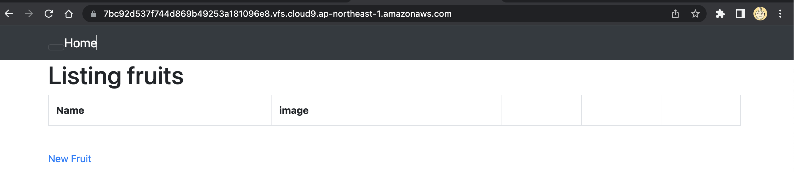

# 第３回 課題

### AP サーバーについて調べてみましょう。

### AP サーバーの名前とバージョンを確認してみましょう

Puma version: 5.6.5 (ruby 3.1.2-p20) ("Birdie's Version")

### AP サーバーを終了させた場合、引き続きアクセスできますか？結果を確認して、また AP サーバーを起動してください。

サーバー接続エラーが表示されアクセスできない。

## DB サーバーについて調べてみましょう。

### サンプルアプリケーションで使った DB サーバー（DB エンジン）の名前と、今 Cloud9 で動作しているバージョンはいくつか確認してみましょう。

mysql  Ver 8.0.31 for Linux on x86_64 (MySQL Community Server - GPL)

rvm 1.29.12 (latest) by Michal Papis, Piotr Kuczynski, Wayne E. Seguin [https://rvm.io]

Rails 7.0.4

aws-cli/1.19.112 Python/2.7.18 Linux/4.14.301-224.520.amzn2.x86_64 botocore/1.20.112


### DB サーバーを終了させた場合、引き続きアクセスできますか？

MySQL接続エラーが表示され、アクセスできませんでした。再接続すると引き続き接続できます。

## Rails の構成管理ツールの名前は何でしたか？確認してみてください。

bundler

## 今回の課題から学んだことを報告してください。

- Linuxの動作メモを記述を残しておくと１から戻ってやり直す時役に立つ。
- サーバーやプログラムのバージョン管理がアプリ開発で重要になってくる。

### 動作メモ

※Cloud9のEBSを10GBから40GBに変更

※円滑に動かすため<strong>t3.small</strong>インスタンスで起動

※Cloud9のEC2にセキュリティグループにインバウンドルールを設定した。SSH、HTTP、HTTPS、8080を開放

### yumのアップデート

```
sudo yum -y update
```

###  mariadbがある場合を想定して先に削除
```
sudo yum remove -y mysql-server
```
```
sudo yum remove -y mariadb*
```

###  "https://dev.mysql.com/get/mysql80-community-release-el7-7.noarch.rpm" をダウンロード

```
wget https://dev.mysql.com/get/mysql80-community-release-el7-7.noarch.rpm
```

```
sudo yum localinstall -y mysql80-community-release-el7-7.noarch.rpm
```
```
sudo yum install -y mysql-community-devel 
```

```
sudo yum install -y mysql-community-server
```

・MySQLサーバーの起動＆確認

```
sudo service mysqld start && sudo service mysqld status
```

・初期パスワードの確認

```
sudo cat /var/log/mysqld.log | grep "temporary password" | awk '{print $13}'
```

・ログイン確認

```
mysql -u root -p
```

・rvm（Ruby Version Manager）を利用すれば、さまざまなバージョンのRubyを指定してインストールできます
```
rvm get stable
```
```
rvm install 3.1.2
```
```
rvm --default use 3.1.2
```

・Rubyドキュメントをスキップする設定を.gemrcファイルに追加するコマンド
```
echo "gem: --no-document" >> ~/.gemrc
```

サンプルAPPをclone
```
git clone https://github.com/yuta-ushijima/raisetech-live8-sample-app.git
```


バージョンを指定してRailsをインストールする
```
gem install rails -v 7.0.4
```

bundlerのバージョンを指定してインストールする
```
gem install bundler -v 2.3.14
```

bundle インストール

```
bundle install
```

### ./config/database.yum の変更部分


・初期パスワードの確認

```
sudo cat /var/log/mysqld.log | grep "temporary password" | awk '{print $13}'
```

### MYSQLの変更部分
```
koseiozaki:~/environment/raisetech-live8-sample-app (main) $ mysql -u root -p                                   
Enter password: 
Welcome to the MySQL monitor.  Commands end with ; or \g.
Your MySQL connection id is 19
Server version: 8.0.31

Copyright (c) 2000, 2022, Oracle and/or its affiliates.

Oracle is a registered trademark of Oracle Corporation and/or its
affiliates. Other names may be trademarks of their respective
owners.

Type 'help;' or '\h' for help. Type '\c' to clear the current input statement.

mysql> SET PASSWORD = '<2nzDqdZ.d=r';
Query OK, 0 rows affected (0.02 sec)

mysql> exit;
Bye

koseiozaki:~/environment/raisetech-live8-sample-app (main) $ rails db:create

Running via Spring preloader in process 19704
Created database 'raisetech_live8_sample_app_development'
Created database 'raisetech_live8_sample_app_test'

koseiozaki:~/environment/raisetech-live8-sample-app (main) $ rails db:migrate
Running via Spring preloader in process 19860
== 20210129231905 CreateFruits: migrating =====================================
-- create_table(:fruits)
   -> 0.0292s
== 20210129231905 CreateFruits: migrated (0.0293s) ============================

== 20211003014450 CreateActiveStorageTables: migrating ========================
-- create_table(:active_storage_blobs)
   -> 0.0347s
-- create_table(:active_storage_attachments)
   -> 0.0422s
-- create_table(:active_storage_variant_records)
   -> 0.0373s
== 20211003014450 CreateActiveStorageTables: migrated (0.1148s) ===============

```

###アプリのmigrationファイルに記載されたテーブル作成
```
rails db:create
```
```
rails db:migrate
```

### ./config/environments/development.rb の変更部分


node.js インストール

```
nvm install 14
```

```
nvm use 14
```

yarnインストール
```
npm install -g yarn
```

webpackerのinstall

```
bundle exec rails webpacker:install
```

scssの手動コンパイル実施　→　「application.css」作成される

```
rails assets:precompile
```

アプリ実行
```
rails s -b 0.0.0.0
```

## アプリ画面

ホーム


<strong>New Fruit</strong>をクリック



画像を送付して画像名を記入して<strong>Save</strong>をクリック


いちごの行が追加された


いちご行の<strong>Destroy</strong>をクリックしていちご行が削除された。


