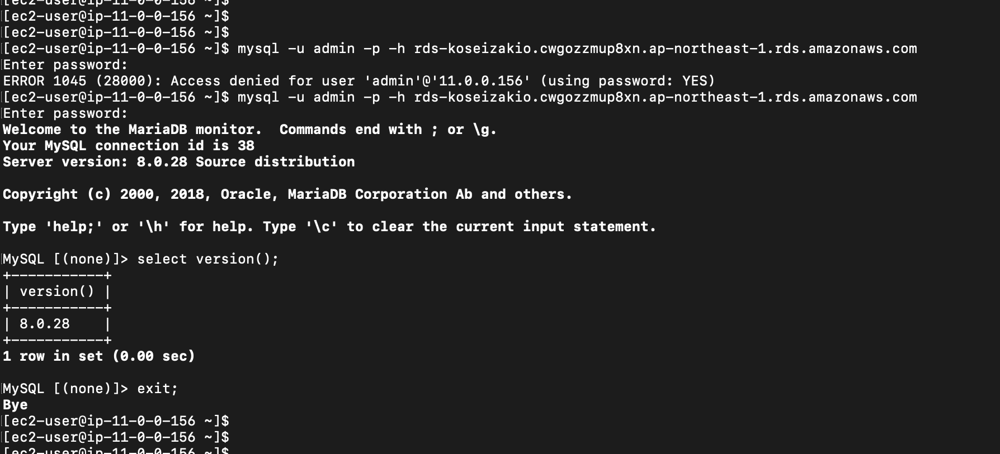

# 第４回 課題

今回は、AWSの https://catalog.us-east-1.prod.workshops.aws/workshops/47782ec0-8e8c-41e8-b873-9da91e822b36/ja-JP を元に第４回の課題を行なった。

構成は、東京リージョンでアベビラリティーゾーンAでEC2とRDSを一つずつ作成した。

## AWS上に新しくVPCを作ってください。

### VPC 作成

### サブネット

### セキュリティグループ

PC から EC2へのセキュリティグループ

EC2 から RDSヘのセキュリティグループ

## EC2 と RDS を構築してください

### EC2の構築結果

### RDSの構築結果

### EC2とRD2でWordPress初期構築画面

## EC2 から RDS へ接続をし、正常であることを確認して報告してください。

参考にしたサイト

https://blog.serverworks.co.jp/ec2-to-private-rds

