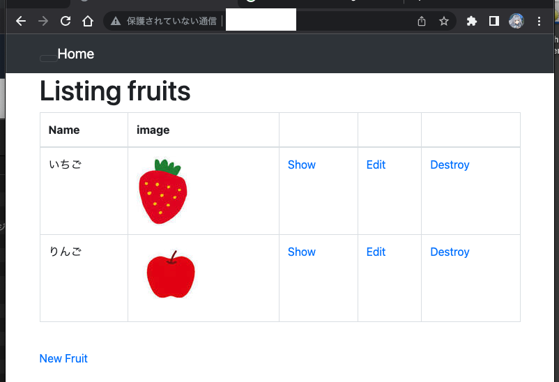
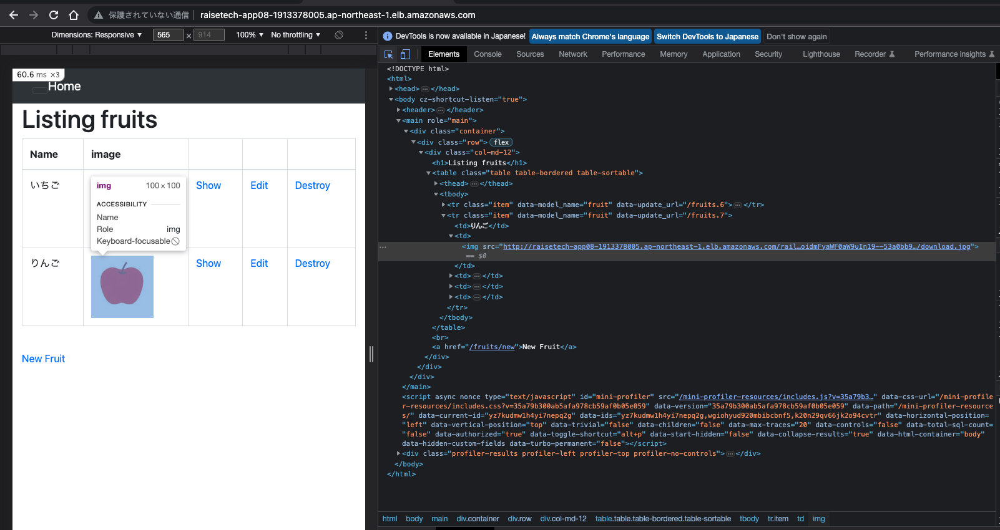

# 第5回課題

## EC2上にサンプルアプリケーションをデプロイして、動作させてください。

### サンプルは第3回で案内済みのものを使ってください。

動作環境構築

Ruby on Rails, Bundler, Node.js, yarn

組み込みサーバー構築

Nginx, Unicorn環境構築・起動

EC2とRDSで動作させたもの

### 動作したら、ELB(ALB)を追加してみましょう。

### ELB を加えて動作が確認できたら、さらに S3 を追加してみましょう。S3 をどのように使うかはお任せします。

今回S3は、DBの連携で利用しました。

Google Chromeでの検証

### ここまでが問題無く動作したら、その環境を構成図に書き起こしてください。

### 感想

エラーでつまづいたり、対処法がわからず苦労しました。

サーバー構築において、LinuxとVimの知識が必要だと痛感した。

わからないところをChat GTPに聞いて質問するのはとても便利だった。
