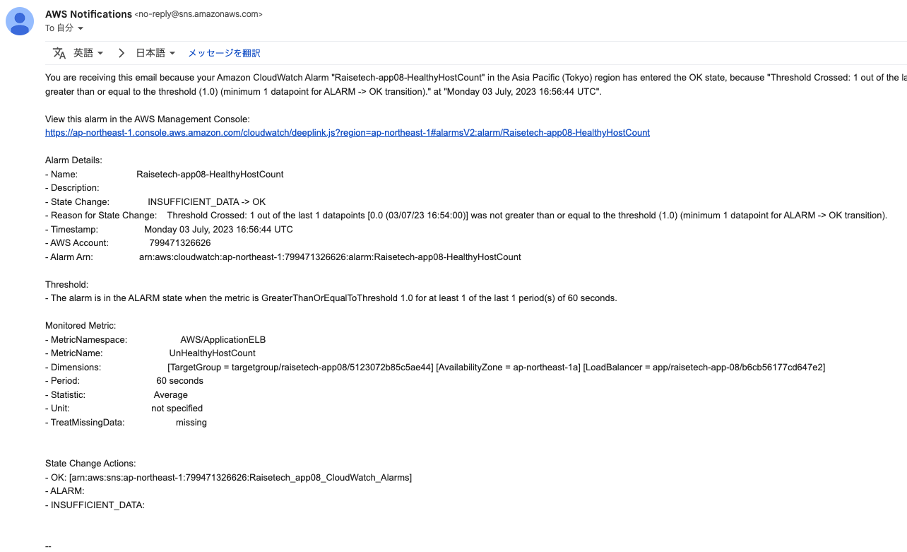

# 第６回課題

- 最後に AWS を利用した日の記録を、どれでもよいので CloudTrail のイベントから探し出してください。
- 今日学んだ CloudWatch アラームを使って、ALB のアラームを設定して、メール通知してみてください。
- AWS 利用料の見積を作成してください。

## あなたが最後に AWS を利用した日の記録を、どれでもよいので CloudTrail のイベントから探し出してください。
 
### ご自身の IAM ユーザー名があるもので OK です。
### 見つけたイベントの中にはどんな情報が含まれていますか。イベント名と、含まれている内容3 つをピックアップしてください。


- Directory Serviceで Simple AD作成
- Amazon Workspaces Ubuntuを作成した内容
- Amazon Lightsailでスナップショット作成

※ 何日何時何分にどのサービスを利用してどのリージョンで何をしたかJSON ビューで記載されていた。

- CloudwatchのJSONの例


## 今日学んだ CloudWatch アラームを使って、ALB のアラームを設定して、メール通知してみてください。

- ```UnHealthyHostCount >= 1``` のとき ```欠落データを不正 (しきい値を超えている)として処理``` で通知


- OKのときメールを送信する設定にした


#### メールには Amazon SNS を使います。デモンストレーションでは設定していませんが、OK アクションも今回は設定してください。

- Amazon SNSの設定


- 初めは、Railsアプリを利用可能にした。


- 次に、Railsアプリを利用不可能にした。


- 最後に、Railsアプリを利用可能にした。



#### 設定すべき内容のヒントは今日の資料にあります。よくあるアラーム設定なので、ネット上で調べても見つかります。

参考URL

[AWS CloudWatchでロードバランサーのターゲットがアンヘルシーになった時に通知す](https://it-ouji.com/2021/02/17/aws-cloudwatch%E3%81%A7%E3%83%AD%E3%83%BC%E3%83%89%E3%83%90%E3%83%A9%E3%83%B3%E3%82%B5%E3%83%BC%E3%81%AE%E3%82%BF%E3%83%BC%E3%82%B2%E3%83%83%E3%83%88%E3%81%8C%E3%82%A2%E3%83%B3%E3%83%98%E3%83%AB/)

#### アラームとアクションを設定した状態で、Rails アプリケーションが使える、使えない状態にして、動作を確認してみてください。どうなりますか？

```sudo service nginx stop``` するとRailsアプリが利用できなくなりUnHealthyHostCountが0から1になる

```sudo service nginx start``` にするとRailsアプリが利用可能になりUnHealthyHostCountが1から0になる

### AWS 利用料の見積を作成してください。
#### 今日までに作成したリソースの内容を見積もってください。


#### できたものは URL を共有してください。

https://calculator.aws/#/estimate?id=f32435c9a96ce8ec439f3a9095a0c9fa25981b31

### マネジメントコンソールから、現在の利用料を確認して教えてください。


※ AWS販促クーポンを利用しているので利用額が0ドルとなった。


#### 先月の請求情報から、EC2 の料金がいくらか確認してください。


#### 無料利用枠で収まっていますか？ ```free tier``` が無料を意味します。

EC2は、t3.microを利用しているので無料枠で収まっていない。

### 感想

- AWSだけでログ出力や監視・通知などができることに驚いた

- サーバーの監視は過剰請求やセキュリティ監視にもなる。

