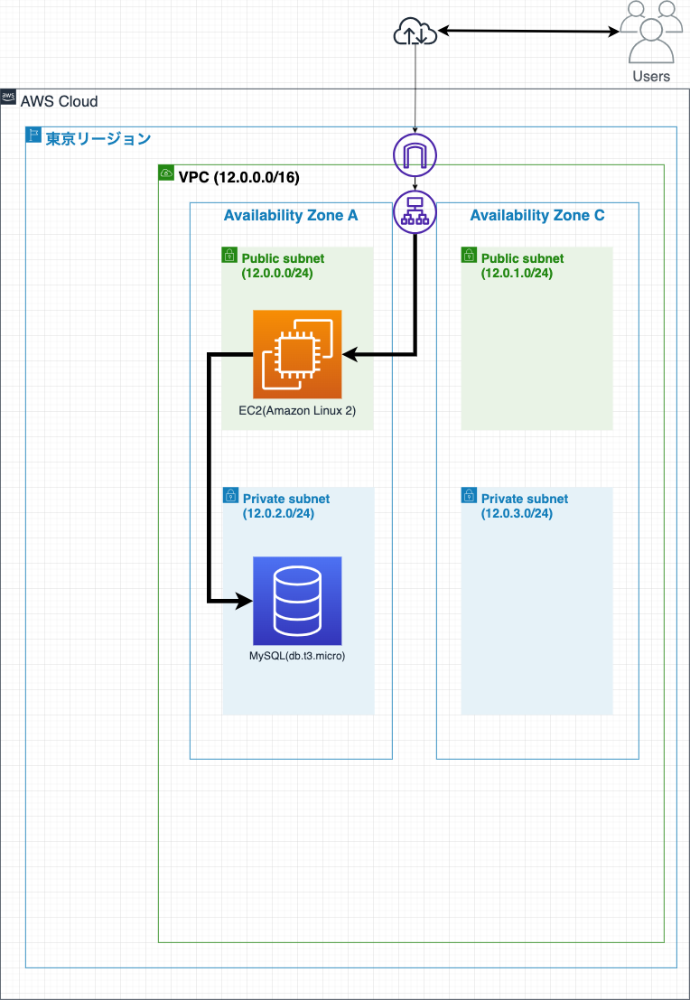
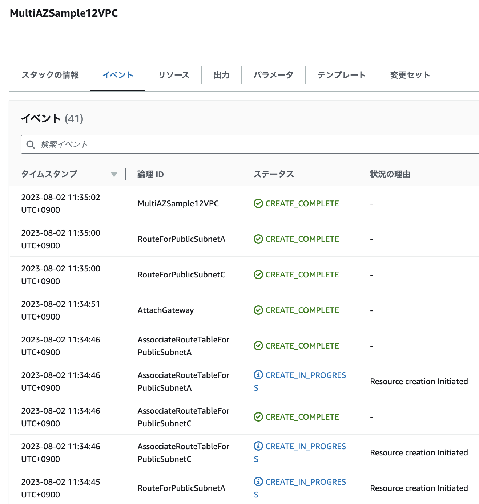
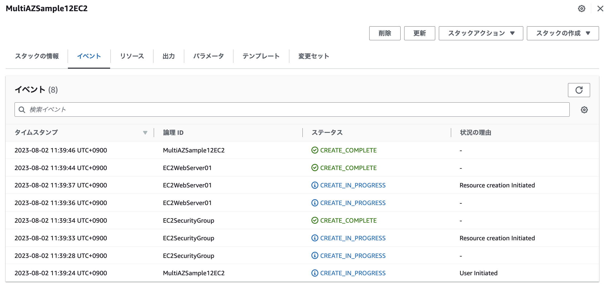
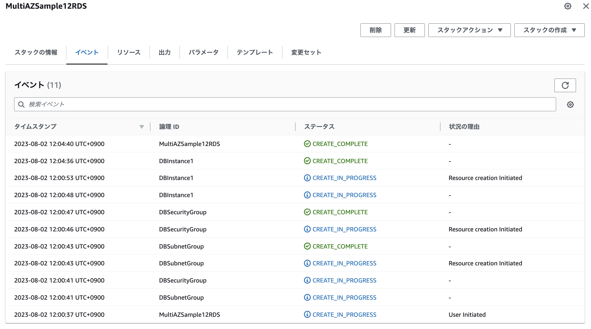
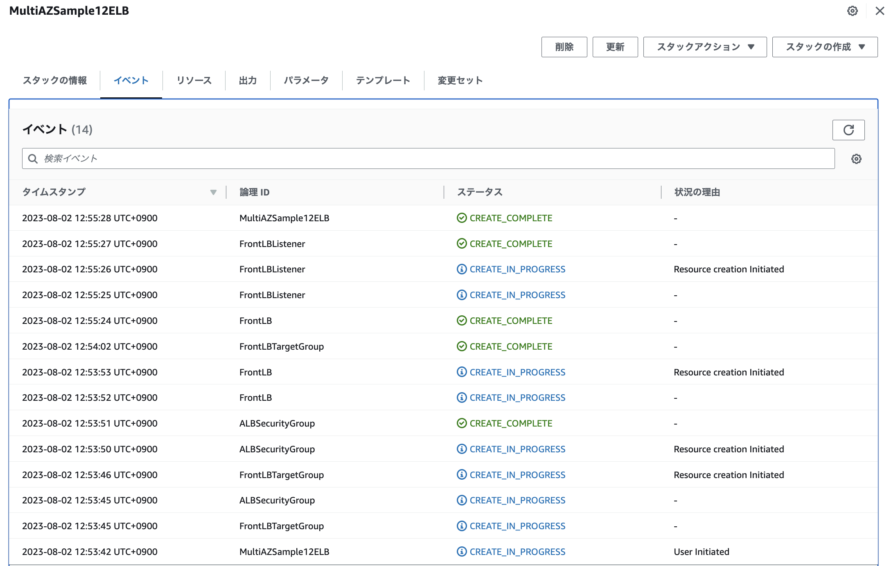
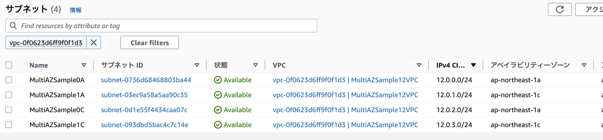
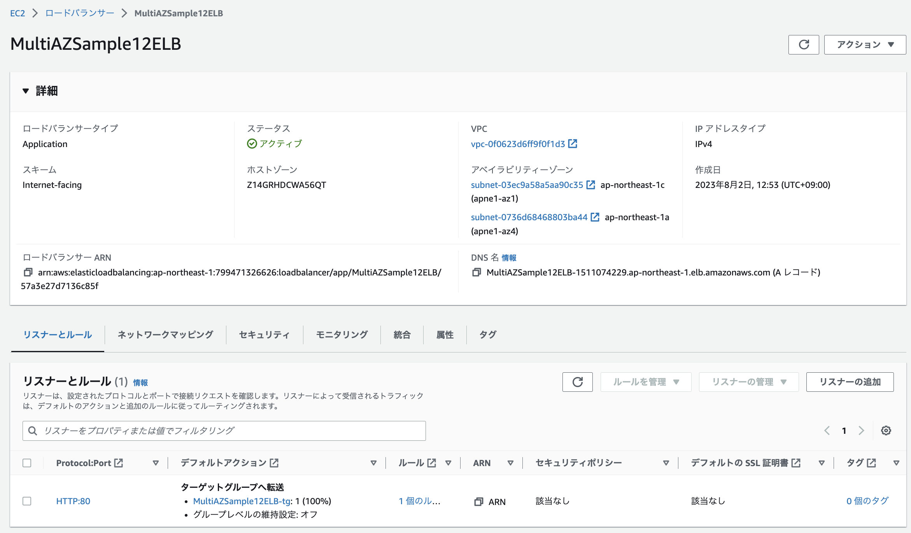
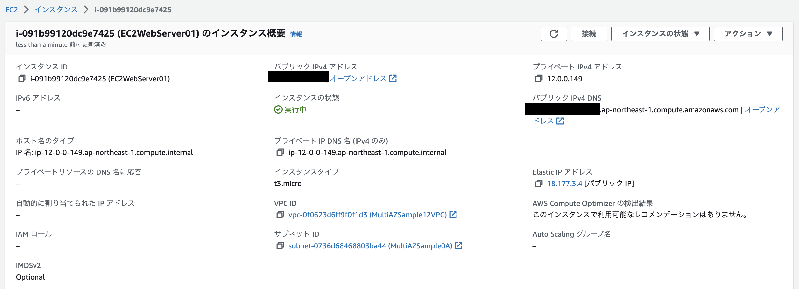
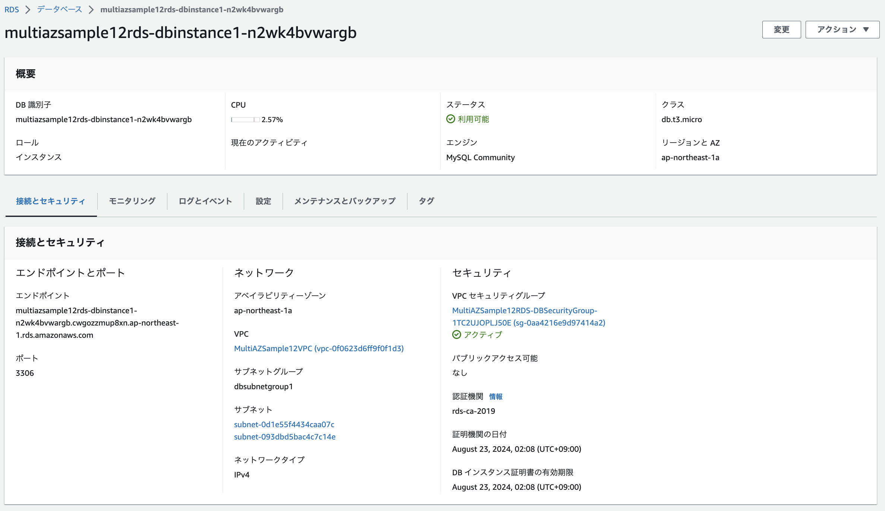

# 第10回課題

- CloudFormation を利用して、現在までに作った環境をコード化しましょう

### 構成図



### cfn-lintインストール

- CloudformationのYAMLの文法を確認するために実行する。

- https://formulae.brew.sh/formula/cfn-lint

### cfn-lint実行

```
cfn-lint vpc.yaml
```

### AWS CLIでCloudformaion実行する

検証

```
aws cloudformation validate-template --template-body file://vpc.yaml
```

```
aws cloudformation validate-template --template-body file://ec2.yaml
```

```
aws cloudformation validate-template --template-body file://rds.yaml
```

```
aws cloudformation validate-template --template-body file://elb.yaml
```

実行

```
aws cloudformation create-stack --stack-name MultiAZSample12VPC --template-body file://vpc.yaml
```

```
aws cloudformation create-stack --stack-name MultiAZSample12EC2 --template-body file://ec2.yaml
```

```
aws cloudformation create-stack --stack-name MultiAZSample12RDS --template-body file://rds.yaml
```

```
aws cloudformation create-stack --stack-name MultiAZSample12ELB --template-body file://vpc.yaml
```

### CloudformationのYAMLファイル

- [VPCのYAML](./cloudformation/vpc.yaml)

- [EC2のYAML](./cloudformation/ec2.yaml)

- [RDSのYAML](./cloudformation/rds.yaml)

- [ELBのYAML](./cloudformation/elb.yaml)

### VPCのスタック



### EC2のスタック



### RDSのスタック



### ELBのスタック



### VPCサブネット



### ELBのターゲットグループ



### EC2のインスタンス



### RDSのインスタンス



### WordPressの表示結果


## 感想

- IaCサービスの利用することでAWSのインフラ構成を容易に構築することができた。